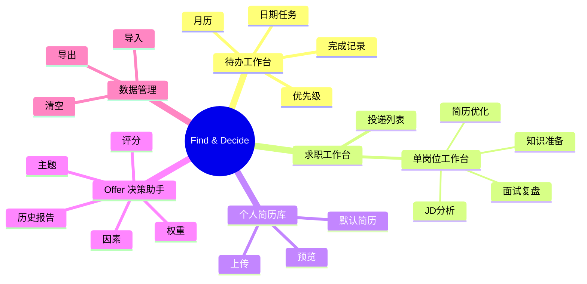
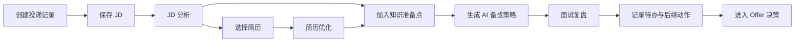
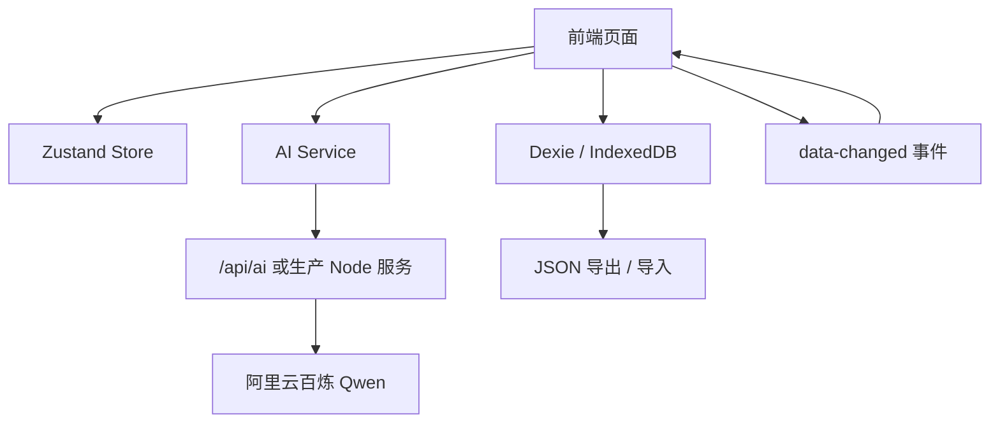

# Find & Decide 产品需求文档（PRD）

> 版本：1.0
>
> 状态：已完成并可通过 GitHub 分发
>
> 形态：单用户、本地优先、AI 辅助的求职工作台
>
> 说明：本 PRD 以当前已实现功能为准，适合作为公开仓库的产品说明与交付文档。

## 1. 产品概述

### 1.1 产品定位

Find & Decide 是一款面向个人求职者的 AI 求职工作台。它把投递管理、JD 拆解、简历匹配、面试备战、面试复盘、Offer 对比和本地数据备份整合在一个页面体系中，帮助用户在求职过程中形成连续、可追踪、可回顾的决策闭环。

### 1.2 竞品分析

  当前市面上的AI求职工具主要聚焦于简历环节——包括JD解析、简历诊断、简历润色与在线制作等功能。即便部分产品尝试覆盖全流程，其核心仍围绕"简历优化+模拟面试"展开，面试知识准备、面试复盘沉淀、多Offer结构化决策等环节普遍缺失，更未与任务日历、待办系统深度整合，用户仍需在多个工具间来回切换。
  本产品的差异化定位在于：不做简历工具的红海竞争，而是聚焦简历之后的"备战-复盘-决策"阶段，通过AI驱动的知识准备、面试意图识别与复盘沉淀，结合加权决策矩阵与任务日历系统，构建真正的一体化求职管理闭环。
  关于功能边界的取舍说明：
未集成投递信息自动爬取：主流招聘平台对自动化爬取有明确的合规限制，存在处罚封号风险，因此采用用户手动录入的方式，确保产品合规性。
未内置简历在线制作功能：多数求职者已有成熟的简历模板，重复造轮子意义不大；产品聚焦于基于AI分析结果给出针对性优化建议，支持小范围定向修改即可，避免功能冗余。

### 1.3 核心价值

1. 让求职进度不再散落在表格、聊天记录和记忆里。
2. 让 JD 变成结构化考点，而不是只读文本。
3. 让简历匹配和面试准备更贴近当前岗位。
4. 让面试复盘沉淀为可继续使用的知识资产。
5. 让 Offer 决策不再只看单一薪资。
6. 让数据默认保存在本机，减少隐私顾虑。

### 1.4 目标用户

- 集中投递期的求职者。
- 需要针对不同岗位定制简历和面试准备的候选人。
- 想对多个 Offer 做理性比较的用户。
- 希望数据保存在本地、可导出备份的用户。

### 1.5 1.0 版本目标

1. 用户可以从 GitHub 下载并本地运行。
2. 用户可以在浏览器中完成投递、分析、备战、复盘、对比与备份。
3. 用户可以配置自己的 AI Key，启用真实 AI 能力。
4. 用户可以在无账号体系下独立保存和导出数据。

## 2. 产品范围

### 2.1 已包含模块

- 待办工作台
- 求职工作台
- 个人简历库
- Offer 决策助手
- 数据管理

### 2.2 求职工作台内能力

- JD 分析
- 简历优化
- 知识准备
- 面试复盘

### 2.3 模型选型—Qwen3.7-max

基于 SuperCLUE 2026年7月最新榜单数据的完整决策逻辑：
1、为什么不选豆包？
  综合分差明显：豆包（Doubao-Seed-2.1-pro）综合得分仅 65.95 分排第三，比 Qwen3.8-Max 低 5.5 分，与第一梯队存在明显差距。
  能力错位：豆包最强项是科学推理（77.19分，全场第一），但产品核心是“简历匹配”和“面试复盘”，需要的是幻觉控制和任务规划。豆包在这两项上分别仅得 78.85 分和 84.95 分，均不如 Qwen。
  指令遵循偏弱：豆包指令遵循仅 42.86 分，在 JD 拆解和结构化输出场景下，容易出现格式不稳定、输出冗余等问题，增加后端解析成本。
  定位偏C端：豆包更擅长日常聊天、生活助手等场景，在需要严谨逻辑分析的工具型产品中，表现不如专注推理和结构的模型。
2、为什么不选 DeepSeek？
  综合分未进前三，关键维度存在短板。
  综合排名靠后：DeepSeek-V4-Flash 综合 65.6 分排第四，V4-Pro 仅 64.4 分排第五，均未进前三。
  指令遵循最弱：V4-Flash 指令遵循仅 35.24 分，V4-Pro 也只有 49.52 分。JD 拆解和简历匹配高度依赖指令遵循，DeepSeek 在此项表现不佳会导致输出不稳定。
  智能体编程偏弱：V4-Flash 智能体编程仅 58.95 分，V4-Pro 更低至 47.37 分，而“面试复盘”本质是智能体任务规划，DeepSeek 在此项上不如 Qwen 和 Kimi。
  提价风险：DeepSeek 已预告整体提价，原因是算力不足。虽然目前价格最低，但未来成本可能上涨，长期预算规划存在不确定性。
3、为什么不选 Kimi？
  成本过高，响应速度慢，性价比不足。
  输出价格极高：Kimi K3 输出价格高达 100元/百万tokens，是 Qwen3.7-Max（36元）的近 3倍。50人规模下月成本约 410 元 vs Qwen 的 90 元（优惠后），差距达 4-5 倍。
  响应速度最慢：Kimi K3 单次响应耗时是最快模型的 3倍，属于低效能梯队。用户提交简历后等待时间过长，严重影响体验。
  综合分微弱领先无实际价值：Kimi K3 综合 70.68 分仅比 Qwen 低 0.8 分，但在幻觉控制（83.85 vs 86.08）和任务规划（84.35 vs 90.94）两个关键维度上均落后。
  优势场景不匹配：Kimi 的强项是智能体编程（75.79分，全场第一），适合程序员写代码。产品定位是求职辅助，不需要工程级代码能力，这个优势用不上。
4、为什么选择 Qwen3.7？
  关键维度全面领先，成本可控，且生命周期有保障。
  关键维度全面领先：Qwen3.8-Max 综合 71.48 分登顶第一，幻觉控制（86.08分）和任务规划（90.94分）均为全场最高，完美匹配“简历匹配”和“面试复盘”的核心需求。
  指令遵循稳定：Qwen3.7-Max 在 IFBench 指令遵循评测中拿到 79.1 分，刷新自身纪录，结构化输出（JSON）稳定性有保障。
  成本可控：Qwen3.7-Max 输入 12元/百万tokens，输出 36元/百万tokens，目前有限时5折优惠（输入6元、输出18元），50人规模月成本约 90-180 元，完全可控。
  版本生命周期明确：Qwen3.6 将在 10.10 下架，Qwen3.7 是当前最新的稳定版本，且 Qwen3.8-Max 已在 SuperCLUE 7月榜单中登顶，说明 Qwen 系列迭代速度快、持续优化。选择 Qwen3.7 既能享受当前成熟能力，又能平滑过渡到后续版本。
  生态与工程化成熟：Qwen 系列在阿里云百炼平台有完善的 API 文档、SDK 和技术支持，开发接入成本低。同时 Qwen 是开源模型，未来如果有私有化部署需求，也有灵活的选择空间。

## 3. 产品结构

### 3.1 路由

| 路由 | 页面 |
|---|---|
| `/` | 重定向到 `/applications` |
| `/todos` | 待办工作台 |
| `/applications` | 求职工作台 / 投递列表 |
| `/applications/:applicationId` | 单岗位工作台 |
| `/resumes` | 个人简历库 |
| `/offers` | Offer 决策助手 |
| `/settings/data` | 数据管理 |

### 3.2 信息架构



## 4. 核心流程

### 4.1 主流程



### 4.2 数据流



## 5. 功能需求

## 5.1 待办工作台

### 功能目标

帮助用户按日期规划求职动作，减少遗漏。

### 核心能力

- 月历视图展示日期任务。
- 任务支持优先级：紧急、较急、不急。
- 任务支持完成、删除。
- 日历日期显示任务数量和紧急提示。
- 同一天的当前任务直接在页面内完成，无需跳转。

### 用户故事

- 作为求职者，我想知道今天要做什么。
- 作为求职者，我想知道某一天是否还有未完成任务。
- 作为求职者，我想快速区分哪些任务更紧急。

## 5.2 求职工作台

### 功能目标

统一管理投递记录、岗位分析和后续准备。

### 投递列表

- 新增、编辑、删除投递记录。
- 按公司名、岗位名搜索。
- 按状态筛选。
- 按投递日期排序。
- 每页 10 条。
- 展示企业性质。
- 支持进入岗位工作台。

### 投递状态

支持状态包括：

- 准备中
- 已投递
- 笔试中
- 面试中
- 一面中
- 二面中
- 三面中
- N面中
- HR面中
- Offer
- 已拒绝
- 已归档

### 企业性质

支持以下分类：

- 公益组织/社会团体
- 股份/集体/混合/其他性质
- 民营企业
- 事业单位
- 外企
- 央国企
- 中外合资/港澳合资

## 5.3 单岗位工作台

单岗位工作台包含四个 Tab：

- JD 分析
- 简历优化
- 知识准备
- 面试复盘

### 5.3.1 JD 分析

#### 输入

- 岗位 JD 原文

#### 输出

- 基础信息
- 硬性门槛
- 加分项
- 关键词
- 风险点
- 岗位画像

#### 设计要求

- 结果应结构化展示。
- 关键词按权重突出显示。
- 风险点按严重程度区分。
- 保留原文展示，方便用户核对。

### 5.3.2 简历优化

#### 输入

- 当前岗位 JD
- 用户选中的简历版本

#### 输出

- 简历匹配度
- 核心优势
- 待优化方向
- 具体修改建议

#### 设计要求

- 支持多份简历切换。
- 支持保存当前分析结果。
- 支持缓存，同一份 JD + 简历组合不重复请求。

### 5.3.3 知识准备

#### 输入来源

- JD 分析中的必备技能和关键考点
- 用户手动添加的知识点
- 简历分析中的弱项与差距
- 用户最终点击“生成 AI 备战策略”时的统一输入

#### 输出

- 业务理解
- 技能考察
- 项目深挖
- 每项包含知识点、模拟面试题、回答提示

#### 设计要求

- JD 阶段加入的技能只作为候选知识点，不强制出题。
- 最终出题时统一生成，避免重复和错位。
- 用户可在生成前继续手动补充知识点。

### 5.3.4 面试复盘

#### 输入

- 面试轮次
- 面试日期
- 面试官
- 问题
- 我的回答
- 自评分

#### 输出

- AI 提问意图
- 回答优化建议
- 原始记录与优化建议对照

#### 设计要求

- 复盘可先保存，再决定是否做 AI 分析。
- 右侧卡片可查看详情。
- 支持删除复盘记录。

## 5.4 个人简历库

### 功能目标

集中管理多个简历版本。

### 核心能力

- 上传 PDF 简历。
- 提取文本。
- 设为默认简历。
- 预览与下载。
- 删除简历。

### 用户价值

- 支持不同岗位使用不同简历版本。
- 为简历优化和知识准备提供输入。

## 5.5 Offer 决策助手

### 功能目标

帮助用户通过加权决策矩阵理性比较多个 Offer。

### 核心能力

- 输入决策主题。
- 新增、删除 Offer 选项。
- 新增、删除因素。
- 为每个因素设置权重。
- 对每个 Offer 打分。
- 自动计算加权总分。
- 高亮推荐项。
- 保存历史决策报告。
- 支持查看和删除历史报告。

### 常见因素

- 薪资福利
- 职业发展
- 工作内容
- 通勤时长
- 公司稳定性
- 团队氛围

## 5.6 数据管理

### 功能目标

提供导出、导入、清空能力，保证用户可控备份。

### 核心能力

- 导出完整备份 JSON。
- 导入覆盖当前本地数据。
- 导入前二次确认。
- 清空前二次确认。
- 导出文件包含时间戳。

### 数据范围

- 投递记录
- JD
- 简历版本
- 简历解析结果
- 知识准备
- 面试复盘
- 待办
- Offer 决策
- AI 缓存

## 6. AI 能力说明

### 6.1 支持的 AI 能力

| 模块 | 功能 | 结果形态 |
|---|---|---|
| JD 分析 | 结构化拆解岗位要求 | JSON |
| 简历优化 | JD 与简历匹配度分析 | JSON |
| 知识准备 | 生成面试备战清单 | JSON |
| 面试复盘 | 解析提问意图与优化建议 | JSON |

### 6.2 AI 设计原则

1. 输出优先结构化。
2. 同一份输入尽量保持稳定。
3. 失败时提供友好提示。
4. 缓存已分析结果，减少重复调用。
5. 本地兜底只用于最低可用，不替代真实模型能力。

### 6.3 AI 依赖与部署

- 开发环境可通过本地代理使用。
- 生产环境推荐使用单服务 Node 部署。
- API Key 只放在服务端环境变量，不写入前端构建产物。

## 7. 数据与存储

### 7.1 存储方式

用户数据默认存储在浏览器 IndexedDB。

### 7.2 备份恢复

- 导出为 JSON。
- 导入时覆盖本地数据。
- 孤立关联数据允许跳过，不阻断整体导入。
- 清空后前端状态也会重置。

### 7.3 缓存

AI 结果按输入摘要缓存，用于：

- JD 分析
- 简历匹配

## 8. 非功能需求

### 8.1 性能

- 主列表可正常支持日常求职规模。
- 简历和 JD 分析应有明确 Loading 状态。
- 本地页面刷新后可快速恢复。

### 8.2 可用性

- 页面层级清晰。
- 核心动作可在一屏内完成。
- 导入/清空前必须确认。

### 8.3 隐私与安全

- 不强制用户注册。
- 不在前端暴露服务端 API Key。
- 用户数据默认不离开本机，AI 调用除外。

## 9. 发布与部署

### 9.1 推荐发布方式

单服务 Web 发布：

```text
Build Command: pnpm install --frozen-lockfile && pnpm build
Start Command: pnpm start
```

### 9.2 部署要求

- 需要支持 Node.js 的托管平台。
- 需要配置 `DASHSCOPE_API_KEY`。
- 需要提供一个公网 HTTPS 访问地址。

## 10. 验收标准

### 10.1 用户可用性

- 用户能从 GitHub 下载并运行项目。
- 用户能打开页面并完成投递管理。
- 用户能进入单岗位工作台并使用四个 Tab。
- 用户能使用待办、Offer 决策和数据管理功能。

### 10.2 AI 能力

- 配置自己的 API Key 后，AI 分析可正常工作。
- 不同模块的 AI 输出可以保存。
- 同一输入可命中缓存，避免重复请求。

### 10.3 数据管理

- 导出文件包含完整本地数据。
- 导入可覆盖本地数据。
- 清空后页面恢复为空状态。

## 11. 风险与限制

1. 本地存储依赖浏览器，换设备需要导出备份。
2. AI 能力依赖用户自己的服务端 Key。
3. 页面目前不含账户体系，因此跨设备同步不可用。
4. 若用户清空浏览器数据，未导出的本地记录会丢失。
5. 版本升级时需注意本地 Schema 迁移。

## 12. 后续迭代建议

- 增加统计看板。
- 增加跨设备导入提示和备份提醒。
- 增加更多 Offer 权重模板。
- 增加更强的 AI 输出校验和错误修复。
